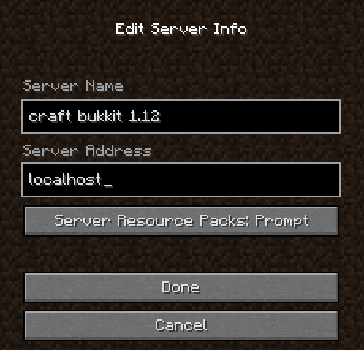
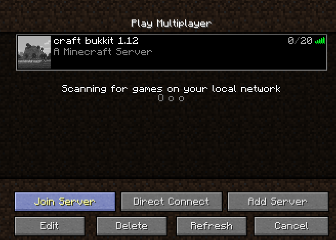

## Minecraft with Scratch and Python

Summer project for getting my boys into the joys of programming. Let's
run some scratch scripts and build the world.

---

### Development Environment

#### Minecraft

1. Download *CraftBukkit 1.12* (modified Minecraft server that supports plugins) from [getbukkit.org](https://getbukkit.org/)

1. Install [java](http://www.oracle.com/technetwork/java/javase/downloads/jre8-downloads-2133155.html)
   version 1.8

1. Start Minecraft server   `java -Xmx1024M -Xms1024M -jar craftbukkit-1.12.jar`

1. Download and install Minecraft Launcher (buy `<minecraft_user>` or more if you what to explore the
   world together) from [minecraft.net](https://minecraft.net)

1. Start the launcher and create a new profile.
   * name: Raspberry Juice
   * version: release 1.12

   Take note of the `<game_directory>`. You'll need it later

1. Start the client with the created profile by pressing PLAY button

1. Select Multiplayer and Add Server. Use localhost for server address

1. Disable pause on focus so you can see the changes

   * go to `<game_directory>` and edit `vim options.txt`
   * set `pauseOnLostFocus:false`
   * restart the client

1. Change game settings. Find the terminal where game server is running. Change game mode to
   creative and make yourself an operator.
   * `gamemode creative <minecraft_user>`
   * `op <minecraft_user>`

#### Install plugin

1. stop the server
   stop

2. Go to bukkit and find raspberryjuice plugin. Download:
 - raspberryjuice-1.9.1.jar
 - copy plugin into servers plugins folder

3. start the server

Install raspberryjuice
https://dev.bukkit.org/projects/raspberryjuice
game version 1.12 16+
https://github.com/zhuowei/RaspberryJuice

:

https://github.com/jbaragry/mcpi-scratch

scratch
Adobe Air
https://get.adobe.com/air/download/?installer=Adobe_AIR_26.0_for_MacOS_X&stype=6622&standalone=1

Scratch
https://scratch.mit.edu/download

